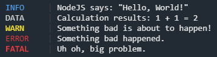

# Logger
NodeJS logger. Part of the WaveLine codebase.

---

### Example Usage
The following demos how each message will look (found in [test.js](test.js)):
```javascript
// Import logger library locally.
const logger = require('./logger')

// Print example messages.
logger.info('NodeJS says: "Hello, World!"')
logger.data('Calculation results: 1 + 1 = 2')
logger.warn('Something bad is about to happen!')
logger.error('Something bad happened.')
logger.fatal('Uh oh, big problem.')
```
Example output:<br>


---

### Message Types

- **`info(message)`** should be used for updating statuses and other related tasks.
- **`data(message)`** should be used for printing outputs and results to the console.
- **`warn(message)`** should be used to warn of issues, mistakes, or things that may cause an error in the future.
- **`error(message)`** should be used to notify the user of non-fatal errors.
- **`fatal(message)`** should be used to notify the user of fatal errors before an application quits due to them.